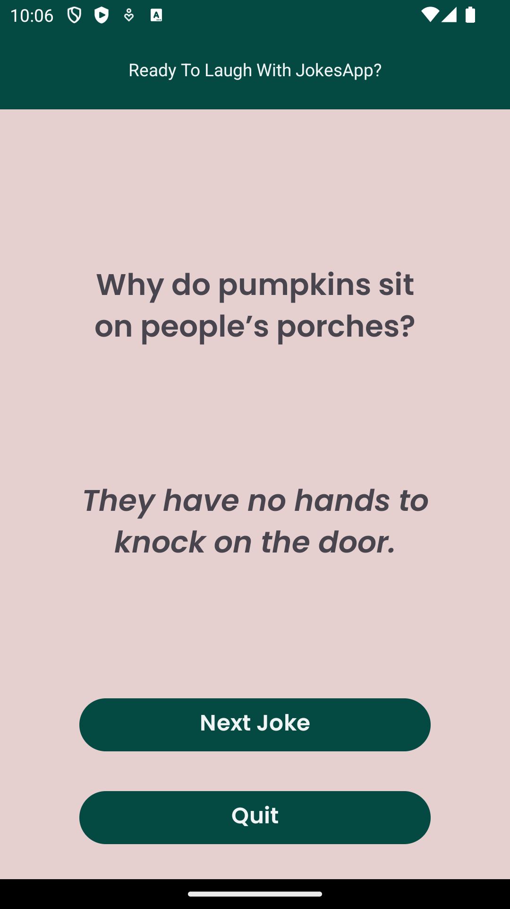

# JokesApp

JokesApp is a light-hearted, single activity Android application designed to bring joy by fetching and presenting random jokes. 

It utilizes the "official-joke-api.appspot.com" API to provide users with a constant stream of humor.

## Screenshots

<table>
  <tr>
    <td></td>
    <td></td>
    <td></td>
  </tr>
</table>

## Features

- **Random Joke Retrieval**: Fetches a random joke from the API.
- **User-Friendly Interface**: Simple and intuitive design for an enjoyable user experience.

## Technologies Used

- **Kotlin**: The primary programming language for the Android application.
- **Retrofit**: A type-safe HTTP client for making API calls.
- **Gson**: A library for JSON serialization/deserialization.

## Contributing

If you wish to contribute to this project, you can follow these steps:

Fork this repository.

Add new features or fixes.

Submit your changes as a pull request.

## Developer

This application was developed by Ozan YİĞİT.
